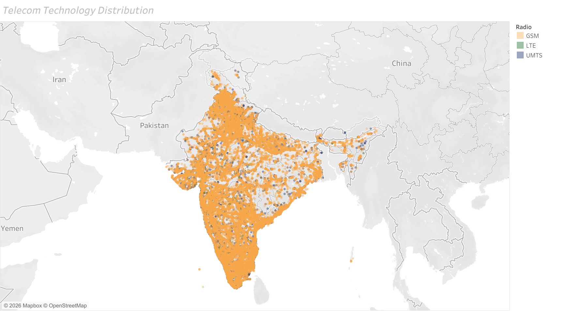
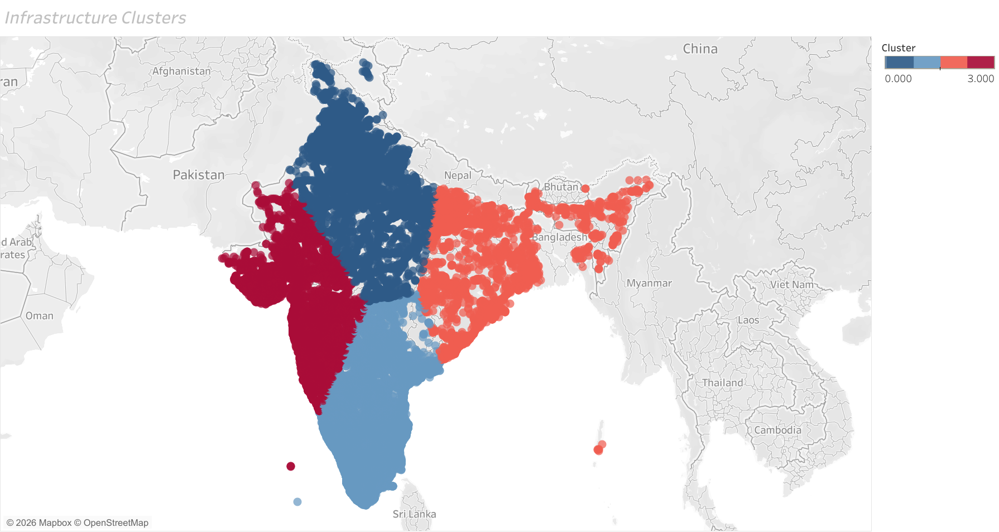
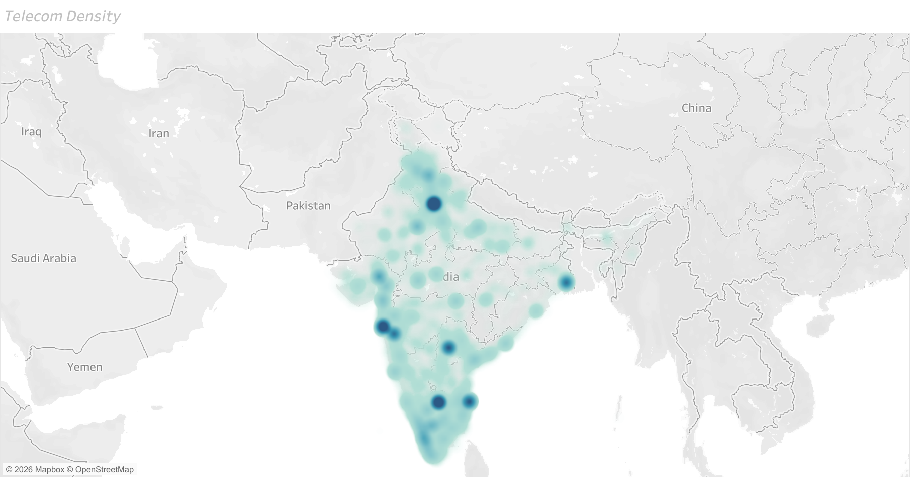
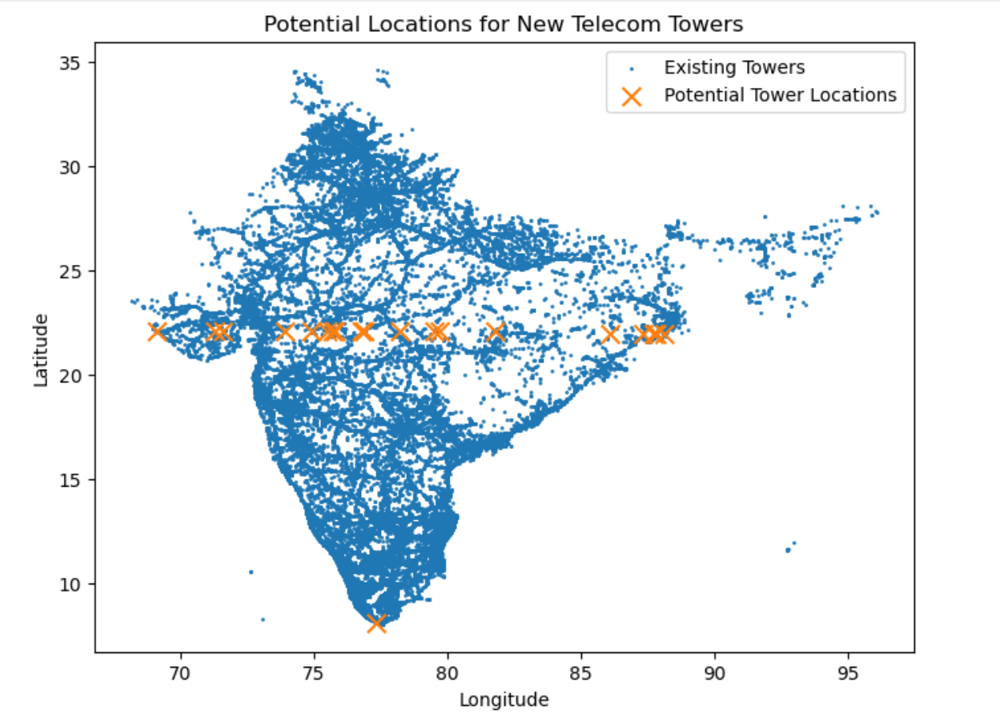
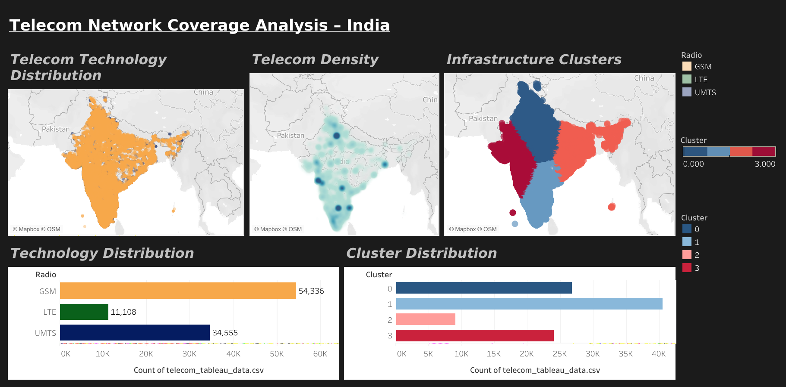

# Telecom Network Coverage Analysis (India)

## Project Overview
This project analyzes telecom tower infrastructure across India using geospatial data analytics.  
The goal is to understand network distribution, identify infrastructure clusters, and detect potential regions for telecom network expansion.

The project combines **Python, Machine Learning, Geospatial Analysis, and Tableau visualization**.

---

## Problem Statement
Telecommunication companies must ensure strong network coverage across different geographic regions.  
However, identifying infrastructure gaps in large telecom datasets can be challenging.

This project aims to:
- Analyze telecom tower distribution across India
- Identify infrastructure clusters using machine learning
- Detect low coverage regions
- Suggest potential telecom tower expansion locations

---

## Dataset
The dataset contains telecom tower data with the following attributes:

- Latitude
- Longitude
- Network Technology (GSM / UMTS / LTE)
- Tower Range
- Signal Sample Count

Dataset size:
1.8 million records (sampled to ~100k for analysis)

---

## Project Workflow

### 1 Data Cleaning
Removed metadata columns and prepared geospatial features.

### 2 Exploratory Data Analysis
Visualized telecom tower distribution across India.

### 3 Geospatial Visualization
Mapped telecom infrastructure using latitude and longitude coordinates.

### 4 Infrastructure Clustering
Applied **K-Means clustering** to identify telecom infrastructure regions.

### 5 Density Analysis
Generated telecom density heatmaps to highlight infrastructure concentration.

### 6 Network Expansion Analysis
Identified potential areas for telecom tower expansion using low-density zones.

---

## Visualizations

### Telecom Tower Distribution

### Infrastructure Clusters

### Telecom Density Heatmap

### Potential Network Expansion Locations

---

## Tableau Dashboard
An interactive dashboard was created in Tableau to explore:

- telecom infrastructure clusters
- network technology distribution
- telecom density patterns

---

## Technologies Used

Python  
Pandas  
NumPy  
Matplotlib  
Seaborn  
Scikit-Learn  
Folium  
Streamlit  
Tableau

## Key Insights

- Southern and Western India show the highest telecom tower density
- GSM infrastructure still dominates the telecom landscape
- LTE deployment is concentrated in economically developed regions
- Several regions in eastern and northeastern India show relatively low tower density

These areas may represent potential telecom infrastructure expansion zones.

---

## Author
Rudra Prasanna Pradhan